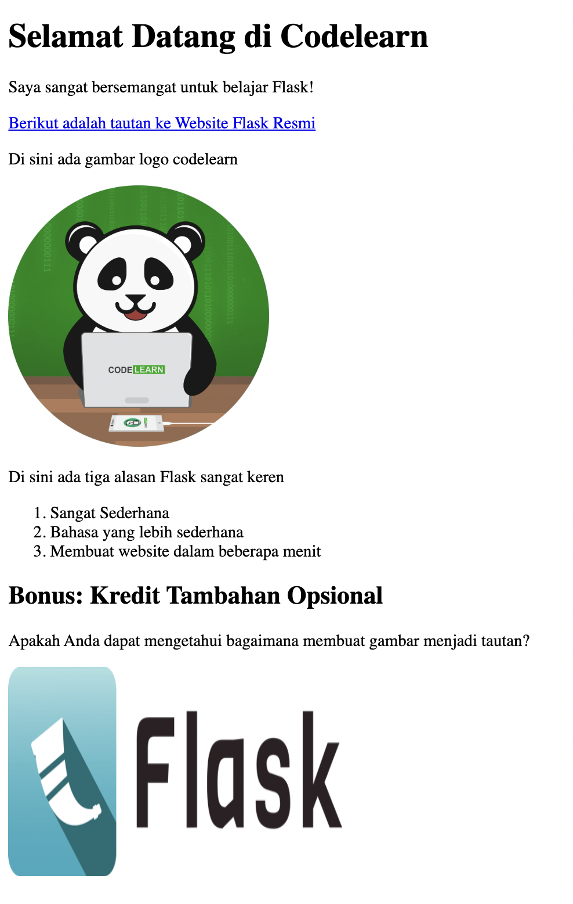

# HTML (*HyperText Markup Language*)

**HTML** (*HyperText Markup Language*) adalah bahasa markup standar yang digunakan untuk membuat dan menyusun halaman web. HTML berfungsi sebagai dasar dari setiap halaman web, di mana ia mengatur struktur dan konten halaman tersebut. Elemen-elemen HTML berupa tag yang digunakan untuk mendefinisikan berbagai bagian dari halaman, seperti judul, paragraf, gambar, tautan, tabel, dan lain-lain.

Berikut beberapa poin penting tentang HTML:

1. **Markup Language**: HTML adalah bahasa markup, artinya tidak melakukan perhitungan atau eksekusi logika seperti bahasa pemrograman, tetapi digunakan untuk menandai atau menstrukturkan konten pada halaman web.
2. **Tag HTML**: HTML menggunakan tag untuk membungkus konten. Sebagian besar tag memiliki pasangan pembuka (`<tag>`) dan penutup (`</tag>`), seperti `<p>` untuk paragraf atau `<h1>` untuk judul utama. Ada juga tag yang tidak memiliki penutup, seperti `` untuk gambar.
3. **HyperText**: HTML memungkinkan untuk menyertakan **hyperlink** yang dapat menghubungkan satu halaman dengan halaman lainnya, baik di dalam situs web yang sama atau di situs web berbeda.
4. **Elemen HTML**: Setiap tag HTML biasanya menyertakan **atribut** yang menyediakan informasi tambahan tentang elemen tersebut. Misalnya, tag `` membutuhkan atribut `src` yang mendefinisikan sumber gambar.
5. **Struktur Dasar HTML**: Setiap dokumen HTML dimulai dengan deklarasi `<!DOCTYPE html>` dan memiliki struktur dasar seperti:

   ```html
   <!DOCTYPE html>
   <html>
     <head>
       <title>Judul Halaman</title>
     </head>
     <body>
       <h1>Ini adalah judul</h1>
       <p>Ini adalah paragraf.</p>
     </body>
   </html>
   ```
6. **Browser**: Browser web seperti Google Chrome, Mozilla Firefox, dan Microsoft Edge menampilkan halaman web berdasarkan kode HTML yang ditulis oleh pengembang. Mereka membaca dan merender HTML untuk menampilkan elemen visual yang dilihat oleh pengguna.

**Kesimpulan:**
HTML adalah pondasi dari halaman web yang menentukan bagaimana konten ditampilkan dan diatur. Meskipun HTML tidak bisa digunakan untuk membuat halaman web interaktif atau dinamis sendiri, kombinasi HTML dengan CSS (untuk tampilan) dan JavaScript (untuk interaktivitas) menciptakan halaman web yang fungsional dan menarik.

## Basic Tangging

**Basic Tagging** dalam HTML mengacu pada penggunaan tag-tag dasar yang paling umum dan penting untuk membuat struktur halaman web. Tag HTML ini menentukan bagaimana elemen-elemen pada halaman web diatur dan ditampilkan oleh browser. Berikut adalah beberapa tag HTML dasar beserta fungsinya:

### 1. **Tag Struktur Dasar HTML**

- `<!DOCTYPE html>`: Menentukan tipe dokumen HTML yang digunakan (HTML5).
- `<html>`: Tag utama yang membungkus seluruh dokumen HTML.
- `<head>`: Bagian ini berisi metadata (informasi tentang dokumen) seperti judul halaman dan link ke file CSS atau JavaScript.
- `<title>`: Menentukan judul halaman yang ditampilkan di tab browser.
- `<body>`: Bagian yang berisi konten yang akan terlihat di halaman web.

   Contoh:

```html
   <!DOCTYPE html>
   <html>
     <head>
       <title>Halaman Saya</title>
     </head>
     <body>
       <!-- Konten halaman -->
     </body>
   </html>
```

### 2. **Tag Heading (Judul)**

   Tag heading digunakan untuk menentukan judul atau subjudul pada halaman web. Ada 6 level heading, dari `<h1>` hingga `<h6>`, di mana `<h1>` adalah yang paling besar (judul utama), dan `<h6>` paling kecil (subjudul kecil).

- `<h1>` hingga `<h6>`: Untuk judul dan subjudul.

   Contoh:

```html
   <h1>Judul Utama</h1>
   <h2>Subjudul Tingkat 2</h2>
```

### 3. **Tag Paragraf**

- `<p>`: Digunakan untuk membuat paragraf teks.

   Contoh:

```html
   <p>Ini adalah sebuah paragraf teks.</p>
```

### 4. **Tag Teks Format**

   Tag ini digunakan untuk memformat teks dalam dokumen.

- `<b>` atau `<strong>`: Membuat teks tebal.
- `<i>` atau `<em>`: Membuat teks miring.
- `<u>`: Membuat teks bergaris bawah.
- `<br>`: Membuat baris baru (line break).

   Contoh:

```html
   <p><strong>Ini teks tebal</strong> dan <em>ini teks miring</em>.</p>
```

### 5. **Tag Link (Hyperlink)**

- `<a>`: Digunakan untuk membuat hyperlink. Atribut `href` menentukan tujuan tautan.

   Contoh:

```html
   <a href="https://www.example.com">Kunjungi Website</a>
```

### 6. **Tag Gambar**

- ``: Digunakan untuk menampilkan gambar. Atribut `src` menentukan sumber gambar dan `alt` berfungsi sebagai teks alternatif jika gambar tidak bisa ditampilkan.

   Contoh:

```html
   
```

### 7. **Tag Daftar (List)**

- `<ul>`: Membuat daftar tidak berurutan (unordered list).
- `<ol>`: Membuat daftar berurutan (ordered list).
- `<li>`: Item dalam daftar.

   Contoh:

```html
   <ul>
     <li>Item 1</li>
     <li>Item 2</li>
   </ul>
   
   <ol>
     <li>Item Pertama</li>
     <li>Item Kedua</li>
   </ol>
```

### 8. **Tag Tabel**

   Tag yang digunakan untuk membuat tabel:

- `<table>`: Membuat tabel.
- `<tr>`: Membuat baris dalam tabel.
- `<th>`: Membuat header kolom tabel (biasanya teks di-bold).
- `<td>`: Membuat sel (cell) data dalam tabel.

   Contoh:

```html
   <table>
     <tr>
       <th>Nama</th>
       <th>Umur</th>
     </tr>
     <tr>
       <td>Alice</td>
       <td>25</td>
     </tr>
     <tr>
       <td>Bob</td>
       <td>30</td>
     </tr>
   </table>
```

### 9. **Tag Div dan Span**

- `<div>`: Digunakan untuk membuat blok container yang dapat menampung elemen lain (biasanya untuk pengaturan layout).
- `<span>`: Digunakan untuk membungkus bagian kecil dari teks atau elemen inline (untuk styling tertentu).

   Contoh:

```html
   <div>
     <p>Ini dalam div.</p>
   </div>
   
   <span>Ini teks di dalam span.</span>
```

### Kesimpulan:

**Basic tagging** mengacu pada penggunaan tag-tag dasar HTML untuk membentuk struktur dan konten halaman web. Dengan memahami dan menguasai tag dasar ini, Anda dapat membuat halaman web yang terstruktur dengan baik dan dapat ditampilkan dengan benar oleh browser.

## HTML List

Dalam HTML, **list** (daftar) digunakan untuk menampilkan kumpulan item secara berurutan atau tidak berurutan. Ada tiga jenis utama list yang sering digunakan:

### 1. **Unordered List (Daftar Tidak Berurutan)**

   Daftar ini menampilkan item tanpa urutan tertentu. Setiap item ditandai dengan simbol seperti bullet (•).

- **Tag Utama**: `<ul>` (unordered list)
- **Item Daftar**: `<li>` (list item)

   **Contoh**:

```html
   <ul>
     <li>Item 1</li>
     <li>Item 2</li>
     <li>Item 3</li>
   </ul>
```

   **Hasilnya**:

- Item 1
- Item 2
- Item 3

### 2. **Ordered List (Daftar Berurutan)**

   Daftar ini menampilkan item dengan urutan numerik atau alfabet. Setiap item diberi nomor atau huruf secara otomatis.

- **Tag Utama**: `<ol>` (ordered list)
- **Item Daftar**: `<li>` (list item)

   **Contoh**:

```html
   <ol>
     <li>Item 1</li>
     <li>Item 2</li>
     <li>Item 3</li>
   </ol>
```

   **Hasilnya**:

1. Item 1
2. Item 2
3. Item 3

   **Atribut Tipe Ordered List**:
   Anda dapat mengubah tipe penomoran menggunakan atribut `type` pada tag `<ol>`:

- `type="1"`: Urutan angka (default).
- `type="A"`: Urutan huruf besar (A, B, C).
- `type="a"`: Urutan huruf kecil (a, b, c).
- `type="I"`: Urutan angka Romawi besar (I, II, III).
- `type="i"`: Urutan angka Romawi kecil (i, ii, iii).

   **Contoh dengan atribut type**:

```html
   <ol type="A">
     <li>Item 1</li>
     <li>Item 2</li>
     <li>Item 3</li>
   </ol>
```

   **Hasilnya**:
   A. Item 1
   B. Item 2
   C. Item 3

### 3. **Definition List (Daftar Definisi)**

   Daftar ini digunakan untuk menampilkan istilah dan definisinya. Setiap istilah didefinisikan oleh sepasang tag `<dt>` dan `<dd>`.

- **Tag Utama**: `<dl>` (definition list)
- **Istilah**: `<dt>` (definition term)
- **Definisi**: `<dd>` (definition description)

   **Contoh**:

```html
   <dl>
     <dt>HTML</dt>
     <dd>HyperText Markup Language, bahasa standar untuk membuat halaman web.</dd>
     <dt>CSS</dt>
     <dd>Cascading Style Sheets, digunakan untuk mendesain tampilan halaman web.</dd>
   </dl>
```

   **Hasilnya**:

- **HTML**: HyperText Markup Language, bahasa standar untuk membuat halaman web.
- **CSS**: Cascading Style Sheets, digunakan untuk mendesain tampilan halaman web.

### 4. **Nested List (Daftar Bersarang)**

   Anda juga dapat membuat daftar yang bersarang, yaitu daftar di dalam daftar. Ini bisa berupa kombinasi dari daftar terurut atau tidak terurut.

   **Contoh Nested List**:

```html
   <ul>
     <li>Item 1
       <ul>
         <li>Subitem 1</li>
         <li>Subitem 2</li>
       </ul>
     </li>
     <li>Item 2</li>
     <li>Item 3</li>
   </ul>
```

   **Hasilnya**:

- Item 1
  - Subitem 1
  - Subitem 2
- Item 2
- Item 3

### Kesimpulan:

HTML menyediakan berbagai jenis list untuk menampilkan informasi secara terstruktur, baik dalam urutan (ordered) maupun tanpa urutan (unordered). Dengan pemahaman tentang penggunaan tag seperti `<ul>`, `<ol>`, dan `<dl>`, Anda dapat membuat halaman web yang lebih teratur dan mudah dibaca.

## Divs Spans

Dalam HTML, **`<div>`** dan **`<span>`** adalah dua elemen dasar yang digunakan untuk mengelompokkan konten atau elemen lain, tetapi mereka memiliki perbedaan utama dalam cara penggunaannya.

### 1. **`<div>`: Division or Block-Level Element**

- **Jenis Elemen**: Block-level
- **Fungsi**: Elemen `<div>` digunakan untuk membuat sebuah blok yang mengelompokkan konten atau elemen lain. Karena elemen ini adalah block-level, ia akan memulai baris baru dan memanjang selebar konten yang ada di dalamnya atau selebar halaman (default 100% lebar halaman).
- **Penggunaan**: Umumnya digunakan untuk membagi halaman menjadi bagian-bagian besar, seperti header, footer, section, atau container konten lainnya.

   **Contoh Penggunaan**:

```html
   <div>
     <h1>Ini adalah judul</h1>
     <p>Ini adalah paragraf dalam div.</p>
   </div>
```

   **Hasilnya**:

- `<div>` mengelompokkan elemen judul dan paragraf menjadi satu blok yang terpisah dari konten lain di halaman.

### 2. **`<span>`: Span or Inline-Level Element**

- **Jenis Elemen**: Inline-level
- **Fungsi**: Elemen `<span>` digunakan untuk menandai atau membungkus bagian kecil dari teks atau konten inline. Karena elemen ini adalah inline-level, ia tidak memulai baris baru dan hanya memakan ruang selebar konten yang ada di dalamnya.
- **Penggunaan**: Biasanya digunakan untuk memformat teks atau mengelompokkan konten kecil dalam satu baris, seperti membuat bagian dari teks menjadi berwarna atau berbeda dari bagian lainnya.

   **Contoh Penggunaan**:

```html
   <p>Ini adalah <span style="color: red;">teks berwarna merah</span> dalam paragraf.</p>
```

   **Hasilnya**:

- `<span>` hanya memengaruhi teks "teks berwarna merah" tanpa memengaruhi elemen lain di paragraf.

### **Perbedaan Utama Antara `<div>` dan `<span>`**:

| **Aspek**              | **`<div>`**                                | **`<span>`**                               |
| ---------------------------- | -------------------------------------------------- | -------------------------------------------------- |
| **Tipe Elemen**        | Block-level                                        | Inline-level                                       |
| **Memulai Baris Baru** | Ya                                                 | Tidak                                              |
| **Penggunaan Umum**    | Untuk mengelompokkan elemen besar atau blok konten | Untuk memformat teks atau bagian kecil dari konten |
| **Lebar Default**      | Mengisi lebar penuh elemen induk                   | Hanya selebar konten di dalamnya                   |

### Contoh Penggunaan Bersama:

Anda bisa menggunakan keduanya untuk tujuan tata letak dan pemformatan yang lebih baik.

```html
<div style="background-color: lightgray; padding: 20px;">
  <h1>Judul dalam Div</h1>
  <p>Ini adalah paragraf di dalam div.</p>
  <p>Ini adalah <span style="color: blue;">teks berwarna biru</span> dalam paragraf.</p>
</div>
```

- **`<div>`** digunakan untuk membungkus seluruh konten, memberikan gaya blok, dan memastikan elemen di dalamnya terstruktur dalam satu grup.
- **`<span>`** digunakan untuk membungkus teks yang diubah warna menjadi biru, tanpa mengganggu aliran paragraf.

### Kesimpulan:

- **`<div>`** sangat cocok digunakan ketika Anda ingin mengelompokkan elemen secara blok dan membuat struktur tata letak halaman.
- **`<span>`** cocok digunakan ketika Anda hanya ingin memformat bagian kecil dari teks atau elemen inline tanpa memengaruhi struktur keseluruhan halaman.

Keduanya sering digunakan bersama dalam pengembangan web untuk mengatur konten dan memberikan styling yang sesuai menggunakan CSS.

## HTML Attributes

**HTML Attributes** adalah informasi tambahan yang diberikan pada elemen HTML untuk mengubah atau menambahkan fitur tertentu pada elemen tersebut. Atribut ditambahkan di dalam tag pembuka elemen dan biasanya berfungsi untuk memberikan instruksi lebih lanjut kepada browser mengenai elemen tersebut.

### Struktur Atribut:

Atribut HTML selalu ditulis dalam format:

```html
<element attribute="value">Content</element>
```

- **element**: Nama elemen HTML (misalnya, `<a>`, ``, `<div>`).
- **attribute**: Nama atribut (misalnya, `href`, `src`, `class`).
- **value**: Nilai dari atribut (misalnya, URL, teks, atau nama class).

### Contoh Penggunaan Atribut:

```html
<a href="https://www.example.com" target="_blank">Kunjungi Example</a>

```

### Beberapa Atribut HTML yang Paling Umum:

1. **`href` (Hyperlink Reference)**

   - **Elemen yang Menggunakan**: `<a>`
   - **Fungsi**: Menentukan URL atau tautan yang akan diarahkan ketika pengguna mengklik elemen tersebut.
   - **Contoh**:
     ```html
     <a href="https://www.example.com">Klik di sini</a>
     ```
2. **`src` (Source)**

   - **Elemen yang Menggunakan**: ``, `<audio>`, `<video>`, `<iframe>`
   - **Fungsi**: Menentukan sumber file eksternal, seperti gambar, video, atau dokumen lain.
   - **Contoh**:
     ```html
     
     ```
3. **`alt` (Alternative Text)**

   - **Elemen yang Menggunakan**: ``
   - **Fungsi**: Menentukan teks alternatif jika gambar tidak dapat ditampilkan. Atribut ini juga penting untuk aksesibilitas.
   - **Contoh**:
     ```html
     
     ```
4. **`title`**

   - **Elemen yang Menggunakan**: Semua elemen HTML
   - **Fungsi**: Menyediakan informasi tambahan berupa teks tooltip yang akan ditampilkan ketika pengguna mengarahkan kursor pada elemen tersebut.
   - **Contoh**:
     ```html
     <p title="Ini adalah paragraf">Arahkan kursor untuk melihat tooltip.</p>
     ```
5. **`class`**

   - **Elemen yang Menggunakan**: Semua elemen HTML
   - **Fungsi**: Memberi nama kelas yang dapat digunakan untuk memberikan gaya CSS pada elemen tertentu. Kelas dapat digunakan berkali-kali pada beberapa elemen.
   - **Contoh**:
     ```html
     <p class="text-utama">Ini adalah paragraf dengan class.</p>
     ```
6. **`id`**

   - **Elemen yang Menggunakan**: Semua elemen HTML
   - **Fungsi**: Memberikan identitas unik pada elemen. Setiap elemen hanya boleh memiliki satu `id`, dan `id` tersebut harus unik di dalam dokumen.
   - **Contoh**:
     ```html
     <div id="header">Ini adalah header.</div>
     ```
7. **`style`**

   - **Elemen yang Menggunakan**: Semua elemen HTML
   - **Fungsi**: Memberikan gaya inline langsung pada elemen menggunakan kode CSS. Namun, praktik yang disarankan adalah memisahkan CSS dari HTML (menggunakan file CSS eksternal).
   - **Contoh**:
     ```html
     <p style="color: red;">Ini adalah teks berwarna merah.</p>
     ```
8. **`target`**

   - **Elemen yang Menggunakan**: `<a>`, `<form>`
   - **Fungsi**: Menentukan di mana halaman tautan akan dibuka. Nilai umum termasuk `_self` (default, membuka di tab saat ini) dan `_blank` (membuka di tab baru).
   - **Contoh**:
     ```html
     <a href="https://www.example.com" target="_blank">Buka di tab baru</a>
     ```
9. **`disabled`**

   - **Elemen yang Menggunakan**: Elemen form seperti `<input>`, `<button>`, `<select>`, `<textarea>`
   - **Fungsi**: Menonaktifkan elemen input sehingga tidak dapat diinteraksi oleh pengguna.
   - **Contoh**:
     ```html
     <input type="text" disabled value="Tidak bisa diubah">
     ```
10. **`placeholder`**

    - **Elemen yang Menggunakan**: `<input>`, `<textarea>`
    - **Fungsi**: Menampilkan teks sementara di dalam kotak input yang menghilang saat pengguna mulai mengetik.
    - **Contoh**:
      ```html
      <input type="text" placeholder="Masukkan nama Anda">
      ```
11. **`value`**

    - **Elemen yang Menggunakan**: `<input>`, `<button>`, `<textarea>`
    - **Fungsi**: Menentukan nilai awal elemen input atau tombol.
    - **Contoh**:
      ```html
      <input type="text" value="Teks Awal">
      ```
12. **`maxlength`**

    - **Elemen yang Menggunakan**: `<input>`, `<textarea>`
    - **Fungsi**: Menentukan jumlah karakter maksimal yang dapat dimasukkan pengguna ke dalam input.
    - **Contoh**:
      ```html
      <input type="text" maxlength="10">
      ```

### Contoh Penggunaan Beberapa Atribut Bersama:

```html
<a href="https://www.example.com" target="_blank" title="Buka contoh website">Kunjungi Example</a>

```

### Kesimpulan:

Atribut HTML memberikan fleksibilitas untuk mengontrol bagaimana elemen HTML berfungsi dan ditampilkan. Dengan atribut, kita dapat menambahkan fungsionalitas, memanipulasi tampilan, dan memberikan informasi tambahan pada elemen di halaman web.

### Tugas 1
Tugas ini meminta Anda untuk membuat kode HTML sesuai contoh dibawah ini

<div align="left">
      
</div>

## Form Basics

Dalam HTML, **form** (formulir) digunakan untuk mengumpulkan data dari pengguna dan mengirimkannya ke server untuk diproses. Formulir adalah elemen penting dalam interaksi pengguna dengan web, seperti login, pendaftaran, atau pencarian.

### Struktur Dasar Formulir

Elemen `<form>` berfungsi sebagai wadah untuk elemen input, tombol, dan kontrol lain yang memungkinkan pengguna memasukkan dan mengirimkan data.

```html
<form action="submit_url" method="POST">
  <!-- Elemen input dan kontrol formulir lainnya akan berada di sini -->
</form>
```

- **`action`**: Menentukan URL tempat data formulir akan dikirim untuk diproses.
- **`method`**: Menentukan metode HTTP yang digunakan untuk mengirim data (biasanya `GET` atau `POST`).
  - **`GET`**: Mengirim data melalui URL (digunakan untuk permintaan pencarian, misalnya).
  - **`POST`**: Mengirim data dalam tubuh (body) permintaan HTTP (lebih aman untuk pengiriman data sensitif).

### Elemen Formulir Utama

1. **Text Input (`<input type="text">`)**

   - Digunakan untuk input teks satu baris.
   - **Atribut Penting**:
     - `name`: Nama variabel yang akan dikirim ke server.
     - `value`: Nilai default dari input.
     - `maxlength`: Jumlah maksimal karakter yang bisa diinput.

   **Contoh**:

   ```html
   <form>
     <label for="username">Username:</label>
     <input type="text" id="username" name="username" placeholder="Masukkan username">
   </form>
   ```
2. **Password Input (`<input type="password">`)**

   - Digunakan untuk input kata sandi, karakter yang dimasukkan tidak akan terlihat (biasanya diganti dengan titik atau bintang).

   **Contoh**:

   ```html
   <form>
     <label for="password">Password:</label>
     <input type="password" id="password" name="password">
   </form>
   ```
3. **Radio Button (`<input type="radio">`)**

   - Digunakan untuk memilih satu dari beberapa pilihan. Semua radio button dengan nama yang sama merupakan bagian dari satu grup.

   **Contoh**:

   ```html
   <form>
     <label><input type="radio" name="gender" value="male"> Laki-laki</label>
     <label><input type="radio" name="gender" value="female"> Perempuan</label>
   </form>
   ```
4. **Checkbox (`<input type="checkbox">`)**

   - Digunakan untuk memilih satu atau lebih dari beberapa opsi. Setiap checkbox berdiri sendiri, meskipun memiliki nama yang sama.

   **Contoh**:

   ```html
   <form>
     <label><input type="checkbox" name="hobby" value="music"> Musik</label>
     <label><input type="checkbox" name="hobby" value="sports"> Olahraga</label>
   </form>
   ```
5. **Dropdown List (`<select>`)**

   - Menyediakan daftar pilihan yang dapat dipilih pengguna.

   **Contoh**:

   ```html
   <form>
     <label for="city">Pilih Kota:</label>
     <select id="city" name="city">
       <option value="jakarta">Jakarta</option>
       <option value="bandung">Bandung</option>
       <option value="surabaya">Surabaya</option>
     </select>
   </form>
   ```
6. **Textarea (`<textarea>`)**

   - Digunakan untuk input teks yang lebih panjang atau lebih dari satu baris.

   **Contoh**:

   ```html
   <form>
     <label for="comments">Komentar:</label>
     <textarea id="comments" name="comments" rows="4" cols="50"></textarea>
   </form>
   ```
7. **Submit Button (`<input type="submit">` atau `<button type="submit">`)**

   - Tombol untuk mengirim data formulir ke server.

   **Contoh**:

   ```html
   <form>
     <input type="submit" value="Kirim">
   </form>
   ```
8. **Reset Button (`<input type="reset">`)**

   - Mengembalikan semua nilai input dalam formulir ke kondisi default.

   **Contoh**:

   ```html
   <form>
     <input type="reset" value="Reset">
   </form>
   ```

### Atribut Penting dalam Formulir

1. **`action`**: URL tempat formulir akan dikirim untuk diproses.**Contoh**:

   ```html
   <form action="/submit-data">
   ```
2. **`method`**: Metode HTTP yang digunakan (`GET` atau `POST`).**Contoh**:

   ```html
   <form method="POST">
   ```
3. **`name`**: Nama yang digunakan untuk mengidentifikasi elemen input. Nama ini dikirim bersama nilai input ke server.**Contoh**:

   ```html
   <input type="text" name="username">
   ```
4. **`placeholder`**: Teks yang ditampilkan dalam input sebelum pengguna memasukkan data.**Contoh**:

   ```html
   <input type="text" placeholder="Masukkan nama Anda">
   ```
5. **`required`**: Atribut boolean yang menandakan bahwa input harus diisi sebelum formulir bisa dikirim.**Contoh**:

   ```html
   <input type="text" name="email" required>
   ```
6. **`maxlength`**: Batas maksimum karakter yang dapat dimasukkan ke dalam input teks.
   **Contoh**:

   ```html
   <input type="text" name="username" maxlength="15">
   ```

### Contoh Formulir Lengkap

```html
<form action="/submit-data" method="POST">
  <label for="username">Username:</label>
  <input type="text" id="username" name="username" required placeholder="Masukkan username">

  <label for="password">Password:</label>
  <input type="password" id="password" name="password" required>

  <label for="city">Kota:</label>
  <select id="city" name="city">
    <option value="jakarta">Jakarta</option>
    <option value="bandung">Bandung</option>
    <option value="surabaya">Surabaya</option>
  </select>

  <label><input type="radio" name="gender" value="male"> Laki-laki</label>
  <label><input type="radio" name="gender" value="female"> Perempuan</label>

  <label><input type="checkbox" name="newsletter" value="yes"> Berlangganan newsletter</label>

  <textarea name="comments" placeholder="Tulis komentar di sini..."></textarea>

  <input type="submit" value="Kirim">
</form>
```

### Kesimpulan

Formulir HTML adalah cara penting untuk berinteraksi dengan pengguna, baik untuk mengumpulkan data atau menjalankan aksi di server. Menggunakan atribut yang tepat memungkinkan Anda untuk memvalidasi dan memproses data dengan cara yang lebih efisien dan aman.

## Form Labels

**Form Labels** dalam HTML digunakan untuk memberikan deskripsi atau petunjuk kepada pengguna tentang apa yang diminta dari setiap elemen input di dalam formulir. Label berfungsi untuk meningkatkan pengalaman pengguna dan aksesibilitas, terutama bagi pengguna yang menggunakan perangkat lunak pembaca layar.

### Cara Membuat Label

Label dapat dibuat menggunakan elemen HTML **`<label>`**, dan elemen ini dapat dihubungkan dengan elemen input seperti teks, checkbox, radio button, dan lainnya.

### Dua Cara Menghubungkan Label dengan Input:

1. **Menggunakan atribut `for` pada elemen `<label>`**:

   - Atribut `for` diisi dengan nilai dari atribut `id` pada elemen input. Ini menghubungkan label dengan input secara eksplisit.

   **Contoh**:

   ```html
   <label for="username">Username:</label>
   <input type="text" id="username" name="username">
   ```

   Dalam contoh di atas, ketika label "Username" diklik, kursor akan secara otomatis berpindah ke input teks yang memiliki `id="username"`.
2. **Membungkus input dengan elemen `<label>`**:

   - Cara lain adalah dengan menempatkan elemen input di dalam elemen `<label>`. Ini menghubungkan label dan input secara implisit.

   **Contoh**:

   ```html
   <label>Username:
     <input type="text" name="username">
   </label>
   ```

   Dalam kasus ini, input teks terhubung langsung ke label tanpa memerlukan `id` atau `for`.

### Contoh Penggunaan untuk Berbagai Elemen Formulir:

1. **Input Teks**:

   ```html
   <label for="email">Email:</label>
   <input type="email" id="email" name="email" required>
   ```
2. **Radio Button**:

   ```html
   <label for="male">Laki-laki</label>
   <input type="radio" id="male" name="gender" value="male">

   <label for="female">Perempuan</label>
   <input type="radio" id="female" name="gender" value="female">
   ```
3. **Checkbox**:

   ```html
   <label for="subscribe">Berlangganan newsletter</label>
   <input type="checkbox" id="subscribe" name="subscribe">
   ```
4. **Dropdown (Select)**:

   ```html
   <label for="city">Kota:</label>
   <select id="city" name="city">
     <option value="jakarta">Jakarta</option>
     <option value="bandung">Bandung</option>
     <option value="surabaya">Surabaya</option>
   </select>
   ```

### Pentingnya Menggunakan Label

1. **Aksesibilitas**: Pengguna dengan keterbatasan atau yang menggunakan pembaca layar (screen readers) akan dapat memahami apa yang diminta oleh setiap input karena label membantu memberikan deskripsi yang jelas.
2. **Interaksi Pengguna**: Mengklik pada label juga akan memfokuskan input terkait, membuat interaksi lebih mudah dan efisien, terutama untuk elemen kecil seperti checkbox atau radio button.
3. **Pengalaman Pengguna yang Lebih Baik**: Label membantu pengguna memahami informasi yang harus dimasukkan dan mengurangi kesalahan input.

### Kesimpulan

Penggunaan label yang benar adalah bagian penting dari pembuatan formulir yang dapat digunakan secara optimal oleh semua pengguna, terutama dalam hal aksesibilitas dan kemudahan penggunaan.

## Form Selections

**Form selections** dalam HTML digunakan untuk membuat daftar pilihan yang dapat dipilih pengguna, biasanya menggunakan elemen **`<select>`**. Ini adalah cara umum untuk menampilkan dropdown atau combo box di dalam formulir. Pengguna dapat memilih satu atau lebih opsi dari daftar tersebut.

### Struktur Dasar Elemen `<select>`

Elemen `<select>` berfungsi sebagai wadah untuk elemen **`<option>`**, yang masing-masing mewakili pilihan dalam daftar.

```html
<select name="name" id="id">
  <option value="value1">Option 1</option>
  <option value="value2">Option 2</option>
  <option value="value3">Option 3</option>
</select>
```

- **`<select>`**: Digunakan untuk mendefinisikan dropdown atau combo box.
  - **`name`**: Nama yang akan dikirim ke server.
  - **`id`**: ID untuk menghubungkan elemen `<label>` atau untuk tujuan JavaScript/CSS.
- **`<option>`**: Setiap elemen ini mewakili satu pilihan dalam dropdown.
  - **`value`**: Nilai yang akan dikirim ke server saat pilihan ini dipilih.

### Contoh Dasar `<select>` dengan Opsi

```html
<form>
  <label for="city">Pilih Kota:</label>
  <select id="city" name="city">
    <option value="jakarta">Jakarta</option>
    <option value="bandung">Bandung</option>
    <option value="surabaya">Surabaya</option>
  </select>
</form>
```

Dalam contoh di atas:

- Daftar dropdown berisi tiga pilihan kota: Jakarta, Bandung, dan Surabaya.
- Nilai yang dikirim ke server sesuai dengan `value` dari masing-masing opsi (`jakarta`, `bandung`, atau `surabaya`).

### Atribut dalam Elemen `<select>`

1. **`name`**: Nama elemen yang akan dikirimkan bersama dengan data formulir.

   - **Contoh**:
     ```html
     <select name="country">
     ```
2. **`id`**: Digunakan untuk menghubungkan dengan elemen `<label>` atau untuk digunakan dengan CSS/JavaScript.

   - **Contoh**:
     ```html
     <select id="country">
     ```
3. **`multiple`**: Atribut boolean yang memungkinkan pengguna memilih lebih dari satu opsi. Saat ini digunakan, tampilan biasanya berubah dari dropdown menjadi daftar.

   - **Contoh**:
     ```html
     <select name="fruits" id="fruits" multiple>
       <option value="apple">Apple</option>
       <option value="banana">Banana</option>
       <option value="cherry">Cherry</option>
     </select>
     ```

### Atribut dalam Elemen `<option>`

1. **`value`**: Nilai yang dikirim ke server saat opsi dipilih.

   - **Contoh**:
     ```html
     <option value="apple">Apple</option>
     ```
2. **`selected`**: Atribut boolean yang menandakan opsi mana yang dipilih secara default saat halaman dimuat.

   - **Contoh**:
     ```html
     <option value="banana" selected>Banana</option>
     ```
3. **`disabled`**: Atribut boolean yang membuat opsi tidak dapat dipilih.

   - **Contoh**:
     ```html
     <option value="cherry" disabled>Cherry</option>
     ```

### Contoh Dropdown dengan Opsi yang Dipilih Secara Default

```html
<form>
  <label for="car">Pilih Mobil:</label>
  <select id="car" name="car">
    <option value="toyota">Toyota</option>
    <option value="honda" selected>Honda</option>
    <option value="ford">Ford</option>
  </select>
</form>
```

Dalam contoh ini, "Honda" dipilih secara default ketika halaman dimuat.

### Dropdown dengan Multi-Select

Dengan menggunakan atribut `multiple`, pengguna dapat memilih lebih dari satu opsi. Biasanya ditampilkan sebagai daftar.

```html
<form>
  <label for="hobbies">Pilih Hobi:</label>
  <select id="hobbies" name="hobbies" multiple>
    <option value="music">Musik</option>
    <option value="sports">Olahraga</option>
    <option value="reading">Membaca</option>
  </select>
</form>
```

### Grouping Opsi Menggunakan `<optgroup>`

Anda dapat mengelompokkan opsi dalam sebuah grup menggunakan elemen **`<optgroup>`**. Ini berguna untuk mengatur opsi yang banyak dalam satu dropdown.

```html
<form>
  <label for="food">Pilih Makanan:</label>
  <select id="food" name="food">
    <optgroup label="Buah">
      <option value="apple">Apple</option>
      <option value="banana">Banana</option>
    </optgroup>
    <optgroup label="Sayuran">
      <option value="carrot">Carrot</option>
      <option value="broccoli">Broccoli</option>
    </optgroup>
  </select>
</form>
```

Dalam contoh di atas, ada dua grup: satu untuk "Buah" dan satu untuk "Sayuran."

### Kesimpulan

Elemen `<select>` dan `<option>` sangat berguna untuk membuat daftar pilihan dalam formulir. Dengan menambahkan atribut seperti `multiple`, `selected`, dan `disabled`, Anda dapat membuat daftar yang fleksibel dan mudah digunakan oleh pengguna.
