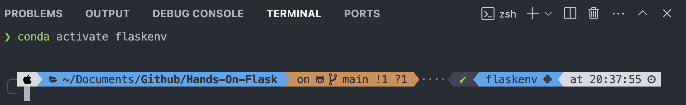
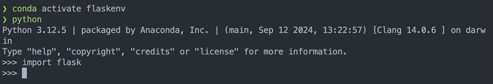

# Hands On Flask

## Instalasi

1. Pastikan python terinstall bisa menggunakan anacondan / miniconda

```zsh
python --version
```

2. Setup Environtment buat environtment baru sehingga terpisah dengan environtment yang lain

```zsh
conda create -n nama_environtment python=3.11  
```

    masuk environtment

```zsh
conda activate nama_environtment
```

keluar environtment

```zsh
conda deactivate
```

3. Instalasi library

   Silakan masuk ke dalam environment yang digunakan kemudian install library-library yang diperlukan. Bila menggunakan Python versi lain, bisa menyesuaikan dengan versi yang sesuai.

<div style="text-align: center;">
    
</div>

Daftar library yang digunakan untuk versi python 3.12.5 :

| Library                     | Versi               |
|-----------------------------|---------------------|
| alembic                     | 1.11.2              |
| blinker                     | 1.6.2               |
| chardet                     | 5.2.0               |
| click                       | 8.1.7               |
| Flask                       | 2.3.30.15          |
| Flask-Dance                 | 6.1.1               |
| Flask-DebugToolbar          | 0.15.1              |
| Flask-Login                 | 0.6.3               |
| Flask-Migrate               | 4.0.7               |
| Flask-OAuthlib              | 0.9.6               |
| Flask-SQLAlchemy            | 3.0.5               |
| Flask-WTF                   | 1.1.1               |
| httplib2                   | 0.22.0              |
| idna                        | 3.4                 |
| itsdangerous                | 2.1.2               |
| Jinja2                      | 3.1.2               |
| lazy                        | 1.4                 |
| Mako                        | 1.3.5               |
| MarkupSafe                  | 2.1.3               |
| oauth2                      | 1.9.0.post1        |
| oauthlib                    | 2.1.0               |
| python-dateutil             | 2.8.2               |
| python-editor               | 1.0.4               |
| requests                    | 2.31.0              |
| requests-oauthlib           | 1.1.0               |
| six                         | 1.16.0              |
| SQLAlchemy                  | 2.0.19              |
| SQLAlchemy-Utils            | 0.41.1              |
| urllib3                     | 2.0.5               |
| URLObject                   | 2.4.5               |
| Werkzeug                    | 3.0.1               |
| wincertstore                | 0.2                 |
| WTForms                     | 3.0.1               |

Jika tidak terjadi error saat menjalankan perintah ini, maka library telah terinstall dengan benar.
nonino
<div style="text-align: center;">
    
</div>